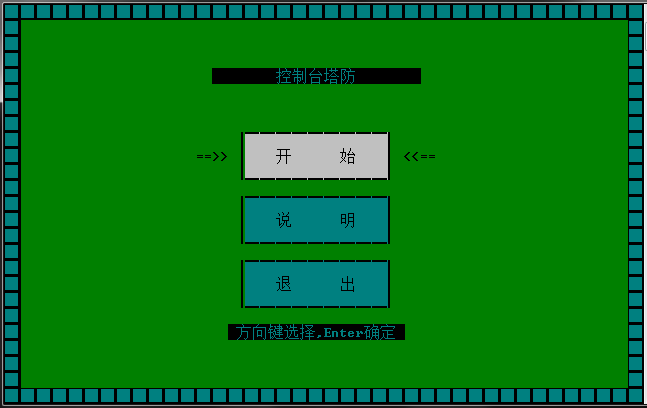
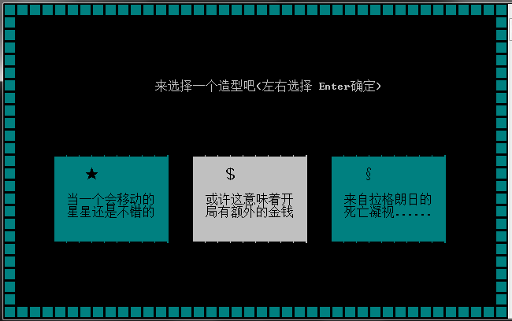
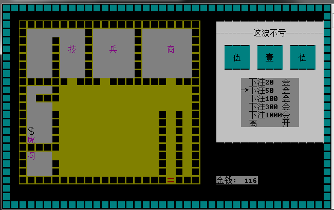
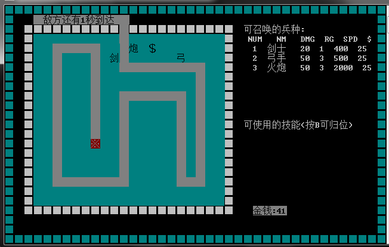
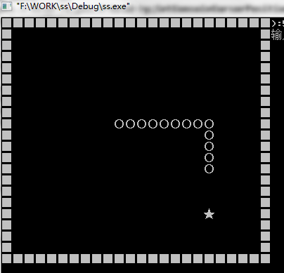
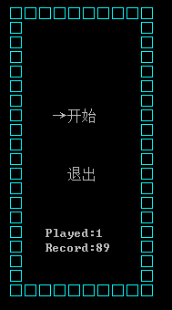
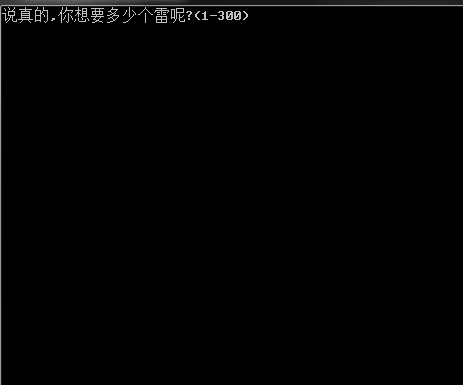

## 几个 windows 终端游戏

很久以前当玩具做的，按规模由小到大有贪吃蛇，扫雷，躲避，塔防（完成度挺高的，虽然代码很混乱，还有技能商店等等系统）四个游戏。

由于时代过于久远，编写的时候是在 Windows7 上用 VC++6.0 编写的，其他平台要顺利编译可能需要做一些修改。

各个游戏里有编译好的 exe，可以直接运行，调用的有一些 API 在 Windows10 上可能工作得不是很好，建议用 windows7 兼容模式启动。

### 终端塔防

上下左右移动，赚钱升级兵种，买高级兵种，学技能。

### 贪吃蛇

没什么好说的。

### 躲避 

### 扫雷

